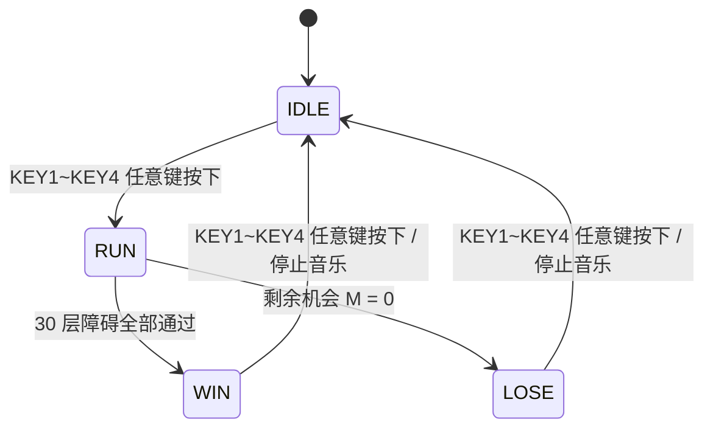

# 避障车 SystemVerilog 实现说明

## 1. 项目概述

本项目基于野火升腾 Mini FPGA 开发板，实现一个使用数码管、独立按键、LED 和蜂鸣器的“避障车”小游戏。玩家通过按键控制车子左右移动，躲避数码管上不断下落的障碍。游戏包含初始、运行、胜利、失败四类状态，并完成生命值显示、碰撞检测、障碍清除和胜败音乐反馈。

本实现采用 SystemVerilog 编写，遵循模块化、单时钟同步设计原则。所有逻辑均运行在 50MHz 系统时钟下，低速事件通过 tick enable 分频产生，不额外引入派生时钟。

## 2. 硬件接口

顶层模块为 `obstacle_car_top`，接口如下：

| 顶层端口         | 方向     | 位宽  | 说明                                   |
|:------------ |:------ |:--- |:------------------------------------ |
| `fpga_clk_i` | input  | 1   | 50MHz 系统时钟                           |
| `reset_n_i`  | input  | 1   | 系统复位按键，低电平有效                         |
| `key_n_i`    | input  | 4   | `KEY1` ~ `KEY4`，低电平有效                |
| `led_o`      | output | 4   | 剩余机会 LED，高电平点亮                       |
| `dig_o`      | output | 6   | 数码管位选，高电平有效                          |
| `seg_o`      | output | 8   | 数码管段选，低电平有效，顺序为 `{DP,G,F,E,D,C,B,A}` |
| `beep_o`     | output | 1   | 无源蜂鸣器 PWM 输出，当前按低电平有效驱动            |

按键映射：

| 按键     | 顶层位          | 游戏功能          |
|:------ |:------------ |:------------- |
| `KEY1` | `key_n_i[0]` | 运行状态下车子右移 1 格 |
| `KEY2` | `key_n_i[1]` | 运行状态下车子左移 1 格 |
| `KEY3` | `key_n_i[2]` | 初始状态下可开始游戏    |
| `KEY4` | `key_n_i[3]` | 初始状态下可开始游戏    |

约束文件为 `vivado/Obstacle_Avoidance_Car_Project/Obstacle_Avoidance_Car_Project.srcs/constrs_1/new/obstacle_car.xdc`，已按题目中的引脚表绑定时钟、复位、按键、LED、数码管和蜂鸣器。

## 3. 模块划分

工程源码位于：

`vivado/Obstacle_Avoidance_Car_Project/Obstacle_Avoidance_Car_Project.srcs/sources_1/new/`

| 模块                   | 文件                                          | 职责                                          |
|:-------------------- |:------------------------------------------- |:------------------------------------------- |
| `obstacle_car_top`   | `obstacle_car_top.sv`                       | 顶层集成，连接按键、游戏核心、数码管和蜂鸣器                      |
| `key_debounce`       | `key_debounce.sv`                           | 低有效按键同步、防抖，并生成高有效单周期按下脉冲                    |
| `tick_gen`           | `tick_gen.sv`                               | 根据 50MHz 时钟产生低速 tick enable                 |
| `hp_led_pwm`         | `hp_led_pwm.sv`                             | 剩余机会 LED PWM 呼吸显示，以及扣血爆闪后熄灭动画               |
| `obstacle_game_core` | `obstacle_game_core.sv`                     | 游戏 FSM、障碍更新、车辆移动、碰撞检测、生命值和胜败判定              |
| `sevenseg_scan`      | `sevenseg_scan.sv`                          | 6 位共阳极数码管动态扫描，输出高有效位选和低有效段选                 |
| `buzzer_note_player` | `buzzer_note_player.sv`                     | 普通碰撞短音，以及背景/胜利/失败蜂鸣器旋律播放                    |

顶层中使用三个主要 tick，LED 特效模块内部还复用 `tick_gen` 产生呼吸和爆闪 tick：

| tick         | 默认频率   | 用途            |
|:------------ |:------ |:------------- |
| `step_tick`  | 2Hz    | 障碍每 0.5s 下落一层 |
| `blink_tick` | 8Hz    | 控制车子闪烁显示      |
| `scan_tick`  | 6000Hz | 数码管动态扫描       |

## 4. 游戏显示模型

数码管 `SM6` ~ `SM1` 被抽象为 6 个横向列，代码中的列编号为 `0` ~ `5`：

- `col = 0`：最左侧，对应 `SM6`
- `col = 5`：最右侧，对应 `SM1`

每一位数码管只使用 `A/G/D` 三个横向段来表示障碍下落位置：

| 游戏层 | 数码管段 | 含义               |
|:--- |:---- |:---------------- |
| 上层  | `A`  | 新障碍出现位置          |
| 中层  | `G`  | 障碍下落中间位置         |
| 下层  | `D`  | 碰撞检测位置，同时也是车子所在层 |

障碍使用常亮段码显示，车子使用 `D` 段闪烁显示。由于开发板数码管只有单色显示，实际硬件上无法显示题目图中的红色和黄色，因此用“常亮”和“闪烁”区分障碍与车子。`IDLE` 状态下中间车位会闪烁，提示当前可按任意键开始。最后一次碰撞导致 HP=0 后，车辆所在列会在失败音乐期间多段爆闪，表示车辆已撞毁。

内部障碍画面使用 18 位 `obstacle_grid` 表示，每列 3 位：

```text
obstacle_grid[col * 3 + 0] -> 上层 A 段
obstacle_grid[col * 3 + 1] -> 中层 G 段
obstacle_grid[col * 3 + 2] -> 下层 D 段
```

## 5. 游戏状态机

`obstacle_game_core` 包含 4 个状态：

| 状态        | 编码     | 说明                                      |
|:--------- |:------ |:--------------------------------------- |
| `ST_IDLE` | `2'd0` | 初始状态，4 个剩余机会 LED 同步呼吸，中间车位闪烁提示，等待任意按键开始 |
| `ST_RUN`  | `2'd1` | 运行状态，处理车辆移动、障碍下落、碰撞和胜败判定                |
| `ST_WIN`  | `2'd2` | 胜利状态，播放胜利音乐，等待任意按键回到初始状态                |
| `ST_LOSE` | `2'd3` | 失败状态，播放失败音乐，等待任意按键回到初始状态                |

状态转换关系：



运行状态规则：

- 初始车子位置为 `col = 3`，即从左到右第 4 列。
- `KEY2` 左移，`KEY1` 右移。
- 到达最左或最右边界后继续按同方向键不会越界。
- `KEY1` 和 `KEY2` 同时按下时不移动，避免方向冲突。
- 每次 `step_tick` 到来，障碍从上层移动到中层，中层移动到下层，并由 LFSR 伪随机刷新生成新的上层障碍。
- `obstacle_game_core` 在 `ST_IDLE` 持续滚动 16 位 LFSR，因此玩家按下开始键的时机不同，会得到不同的障碍序列。默认种子由参数 `LFSR_SEED = 16'hACE1` 给出。
- 生成新障碍时，核心维护一条 `safe_col` 安全通道。安全列会保持 2 到 3 层后强制左移或右移 1 格，边界处自动向内回拐；拐弯时上一条安全列会临时作为过渡列留空，避免难度过硬。每行通过“全障碍掩码清掉 3 个空位”的方式保留约 3 个障碍，额外空位优先选择上一行有障碍的列，减少同列连续刷新的观感。这里的“不会进入死局”表示关卡始终存在一条按键可达路线，玩家操作失误仍然会碰撞扣血。
- 当下层障碍与车子列号相同，判定碰撞；碰撞后该障碍消失，生命值 `M` 减 1。普通碰撞会触发蜂鸣器短促提示音；最后一次碰撞直接进入失败反馈，不额外播放普通碰撞短音。
- 当 `M = 0` 时失败；当 30 层障碍全部生成并完全离开画面后胜利。

## 6. 生命值与蜂鸣器

生命值由 `hp_count` 表示，初始值为 4。LED 为高电平点亮，并由 `hp_led_pwm` 做 PWM 特效：

| `hp_count` | 剩余机会掩码    |
|:---------- |:--------- |
| 4          | `4'b1111` |
| 3          | `4'b0111` |
| 2          | `4'b0011` |
| 1          | `4'b0001` |
| 0          | `4'b0000` |

掩码内的 LED 同步呼吸，最低亮度不降到 0，避免剩余机会在呼吸低谷完全不可见。当 `hp_count` 减小时，`hp_led_pwm` 通过寄存后的 `hp_count_d` 检测减少事件，被扣除的 LED 快速爆闪约 0.5s 后熄灭，其他剩余 LED 继续呼吸。该模块只使用 `posedge clk_i` 和 tick enable，不使用下降沿或派生时钟。

蜂鸣器模块 `buzzer_note_player` 使用无源蜂鸣器常见播放方式：音符表 + 节拍表 + 方波分频器。

- 背景音乐：进入 `RUN` 后循环播放 `See You Again` 主旋律背景曲。
- 胜利音乐：进入 `ST_WIN` 后播放一次短促上行胜利提示音。
- 失败音乐：进入 `ST_LOSE` 后播放一次短促下行失败提示音。
- 普通碰撞：播放约 150ms、约 1kHz 的短促提示音。
- 胜利/失败音乐可自行播完并静音，但状态机不会自动返回 `IDLE`；玩家按任意键后立即返回 `IDLE` 并停止当前音乐。
- 音乐数据由 `tools/generate_buzzer_note_player.py` 生成，脚本同时输出 `buzzer_note_player.sv` 和 `music/note_player_preview/` 下的 WAV 试听文件。
- RTL 内部不保存 PCM 采样，只保存音符编号和节拍长度。每个音符通过 `CLK_HZ / (note_hz * 2)` 计算半周期计数，到点翻转内部方波 `beep_raw`，再按 `BUZZER_ACTIVE_LOW` 极性输出到 `beep_o`，从而适配低电平有效的无源蜂鸣器模块。

## 7. 验证方法

仿真文件位于：

`vivado/Obstacle_Avoidance_Car_Project/Obstacle_Avoidance_Car_Project.srcs/sim_1/new/tb_obstacle_car.sv`

当前已使用 Vivado 前端编译器 `xvlog` 完成 SystemVerilog 语法检查。

已验证场景：

- 低有效 `KEY1` 按下后，防抖模块只产生一个高有效 `key_pressed` 脉冲。
- 初始状态下 `KEY1` ~ `KEY4` 任意键均可开始游戏，并启动循环背景音乐。
- `KEY2` 控制车子左移，`KEY1` 控制车子右移。
- 车辆移动到左右边界后不会越界。
- `KEY1` 和 `KEY2` 同时按下时车子不移动。
- `hp_led_pwm` 在 hp=4 时四灯同步 PWM 呼吸，扣血时被扣 LED 爆闪后熄灭，hp=0 时全灭，hp 恢复后重新呼吸。
- 普通碰撞只触发 `collision_start` 短音事件，不触发车辆视觉爆闪。
- 最后一次碰撞进入失败状态时，`crash_effect` 保持有效，车辆所在数码管列快速爆闪，并启动失败音乐。
- `buzzer_note_player` 的普通碰撞短音会翻转内部方波并驱动 `beep_o`，短音结束不产生 `done`。
- 胜利/失败音乐结束后保持结算态静音；任意按键会停止当前音乐并回到初始状态。
- LFSR 刷新的障碍行不是固定重复图案，生成期内每行约 3 个障碍，不会出现 6 列全堵，且始终存在会缓慢拐弯的可达安全路径。
- 主动撞击可达障碍 4 次后进入失败状态，生命值变为 0，触发失败音乐，按键后返回初始状态。
- 自动选择可达安全路线通过全部障碍后进入胜利状态，生命值保持为 4，触发胜利音乐，按键后返回初始状态。

已执行并通过的命令：

```bash
xvlog -sv \
  -i vivado/Obstacle_Avoidance_Car_Project/Obstacle_Avoidance_Car_Project.srcs/sources_1/new \
  vivado/Obstacle_Avoidance_Car_Project/Obstacle_Avoidance_Car_Project.srcs/sources_1/new/tick_gen.sv \
  vivado/Obstacle_Avoidance_Car_Project/Obstacle_Avoidance_Car_Project.srcs/sources_1/new/hp_led_pwm.sv \
  vivado/Obstacle_Avoidance_Car_Project/Obstacle_Avoidance_Car_Project.srcs/sources_1/new/key_debounce.sv \
  vivado/Obstacle_Avoidance_Car_Project/Obstacle_Avoidance_Car_Project.srcs/sources_1/new/obstacle_game_core.sv \
  vivado/Obstacle_Avoidance_Car_Project/Obstacle_Avoidance_Car_Project.srcs/sources_1/new/sevenseg_scan.sv \
  vivado/Obstacle_Avoidance_Car_Project/Obstacle_Avoidance_Car_Project.srcs/sources_1/new/buzzer_note_player.sv \
  vivado/Obstacle_Avoidance_Car_Project/Obstacle_Avoidance_Car_Project.srcs/sources_1/new/obstacle_car_top.sv
```

检查结果：所有 RTL 文件均被 `xvlog` 正常分析，未报 SystemVerilog 语法错误。

## 8. Vivado 使用说明

工程文件：

`vivado/Obstacle_Avoidance_Car_Project/Obstacle_Avoidance_Car_Project.xpr`

该 `.xpr` 已加入 RTL、XDC 和仿真文件集：

- 综合顶层：`obstacle_car_top`
- 仿真顶层：`tb_obstacle_car`
- 约束文件：`obstacle_car.xdc`

在有 Vivado 的环境中，建议按以下顺序检查：

1. 打开 `.xpr`，确认 Sources 中能看到 7 个 RTL 文件，其中包含 `buzzer_note_player.sv`。
2. 确认 Constraints 中启用了 `obstacle_car.xdc`。
3. 运行 Behavioral Simulation，观察 testbench 是否通过。
4. 运行 Synthesis，确认无 latch、无多驱动、无未约束顶层端口。
5. 运行 Implementation 和 Generate Bitstream。
6. 下载到开发板后检查：
   - 初始状态 4 个 LED 同步呼吸、数码管中间车位闪烁。
   - 任意 KEY 开始游戏。
   - `KEY2` 左移、`KEY1` 右移，按键为低有效。
   - 障碍常亮下落，车子底层闪烁。
   - 游戏进行中循环播放背景音乐；普通碰撞时蜂鸣器发出短促提示音，被扣除的 LED 爆闪后熄灭，其余剩余机会 LED 继续呼吸。
   - 最后一次碰撞导致 HP=0 时，车辆所在数码管列快速爆闪并播放失败音乐。
   - 胜利/失败后蜂鸣器播放不同音乐，按任意键返回初始状态。

## 9. 可扩展方向

当前版本完成基础功能、背景/胜败音乐和 PWM 呼吸灯扣血动画。后续若需要继续加分，可以在现有架构上扩展：

- 动态难度：根据 `spawn_count` 调整 `step_tick` 频率或步进间隔。
- 更复杂音乐：增加音符表的半音、八度和节拍精度，或改用 SPI Flash / SD 卡流式读取 PCM 音频。
- 障碍参数化：把 LFSR 种子、障碍密度、安全通道保持层数和移动策略做成可配置参数，便于调节关卡风格。
