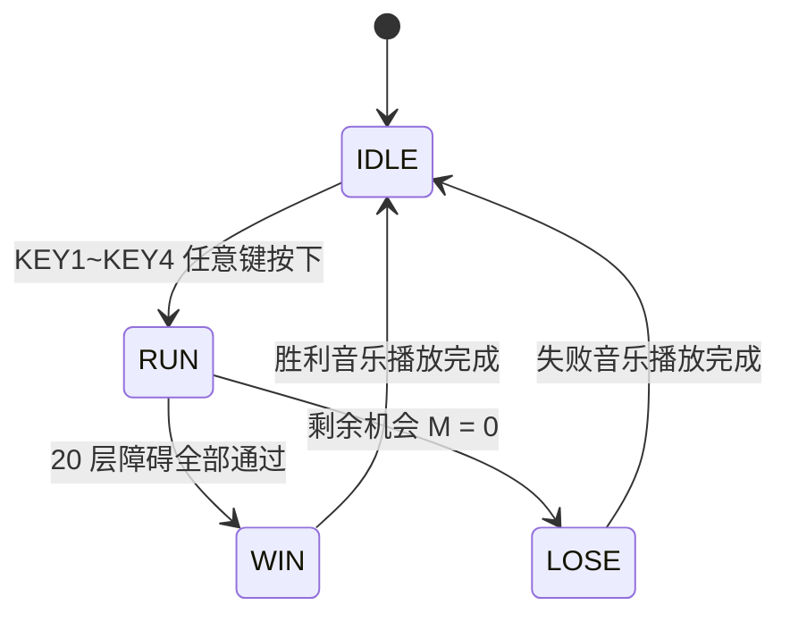

# 避障车 SystemVerilog 实现说明

## 1. 项目概述

本项目基于野火升腾 Mini FPGA 开发板，实现一个使用数码管、独立按键、LED 和蜂鸣器的“避障车”小游戏。玩家通过按键控制车子左右移动，躲避数码管上不断下落的障碍。游戏包含初始、运行、胜利、失败四类状态，并完成生命值显示、碰撞检测、障碍清除和胜败音乐反馈。

本实现采用 SystemVerilog 编写，遵循模块化、单时钟同步设计原则。所有逻辑均运行在 50MHz 系统时钟下，低速事件通过 tick enable 分频产生，不额外引入派生时钟。

## 2. 硬件接口

顶层模块为 `obstacle_car_top`，接口如下：

| 顶层端口 | 方向 | 位宽 | 说明 |
| :--- | :--- | :--- | :--- |
| `fpga_clk_i` | input | 1 | 50MHz 系统时钟 |
| `reset_n_i` | input | 1 | 系统复位按键，低电平有效 |
| `key_n_i` | input | 4 | `KEY1` ~ `KEY4`，低电平有效 |
| `led_o` | output | 4 | 剩余机会 LED，高电平点亮 |
| `dig_o` | output | 6 | 数码管位选，低电平有效 |
| `seg_o` | output | 8 | 数码管段选，低电平有效，顺序为 `{DP,G,F,E,D,C,B,A}` |
| `beep_o` | output | 1 | 无源蜂鸣器 PWM 输出 |

按键映射：

| 按键 | 顶层位 | 游戏功能 |
| :--- | :--- | :--- |
| `KEY1` | `key_n_i[0]` | 运行状态下车子右移 1 格 |
| `KEY2` | `key_n_i[1]` | 运行状态下车子左移 1 格 |
| `KEY3` | `key_n_i[2]` | 初始状态下可开始游戏 |
| `KEY4` | `key_n_i[3]` | 初始状态下可开始游戏 |

约束文件为 `vivado/Obstacle_Avoidance_Car_Project/Obstacle_Avoidance_Car_Project.srcs/constrs_1/new/obstacle_car.xdc`，已按题目中的引脚表绑定时钟、复位、按键、LED、数码管和蜂鸣器。

## 3. 模块划分

工程源码位于：

`vivado/Obstacle_Avoidance_Car_Project/Obstacle_Avoidance_Car_Project.srcs/sources_1/new/`

| 模块 | 文件 | 职责 |
| :--- | :--- | :--- |
| `obstacle_car_top` | `obstacle_car_top.sv` | 顶层集成，连接按键、游戏核心、数码管和蜂鸣器 |
| `key_debounce` | `key_debounce.sv` | 低有效按键同步、防抖，并生成高有效单周期按下脉冲 |
| `tick_gen` | `tick_gen.sv` | 根据 50MHz 时钟产生低速 tick enable |
| `obstacle_game_core` | `obstacle_game_core.sv` | 游戏 FSM、障碍更新、车辆移动、碰撞检测、生命值和胜败判定 |
| `sevenseg_scan` | `sevenseg_scan.sv` | 6 位共阳极数码管动态扫描，输出低有效位选和段选 |
| `buzzer_player` | `buzzer_player.sv` | 胜利/失败 8 音符蜂鸣器旋律播放 |

顶层中使用三个 tick：

| tick | 默认频率 | 用途 |
| :--- | :--- | :--- |
| `step_tick` | 2Hz | 障碍每 0.5s 下落一层 |
| `blink_tick` | 8Hz | 控制车子闪烁显示 |
| `scan_tick` | 6000Hz | 数码管动态扫描 |

## 4. 游戏显示模型

数码管 `SM6` ~ `SM1` 被抽象为 6 个横向列，代码中的列编号为 `0` ~ `5`：

- `col = 0`：最左侧，对应 `SM6`
- `col = 5`：最右侧，对应 `SM1`

每一位数码管只使用 `A/G/D` 三个横向段来表示障碍下落位置：

| 游戏层 | 数码管段 | 含义 |
| :--- | :--- | :--- |
| 上层 | `A` | 新障碍出现位置 |
| 中层 | `G` | 障碍下落中间位置 |
| 下层 | `D` | 碰撞检测位置，同时也是车子所在层 |

障碍使用常亮段码显示，车子使用 `D` 段闪烁显示。由于开发板数码管只有单色显示，实际硬件上无法显示题目图中的红色和黄色，因此用“常亮”和“闪烁”区分障碍与车子。

内部障碍画面使用 18 位 `obstacle_grid` 表示，每列 3 位：

```text
obstacle_grid[col * 3 + 0] -> 上层 A 段
obstacle_grid[col * 3 + 1] -> 中层 G 段
obstacle_grid[col * 3 + 2] -> 下层 D 段
```

## 5. 游戏状态机

`obstacle_game_core` 包含 4 个状态：

| 状态 | 编码 | 说明 |
| :--- | :--- | :--- |
| `ST_IDLE` | `2'd0` | 初始状态，LED 全亮，数码管清空，等待任意按键开始 |
| `ST_RUN` | `2'd1` | 运行状态，处理车辆移动、障碍下落、碰撞和胜败判定 |
| `ST_WIN` | `2'd2` | 胜利状态，播放欢快音乐，音乐结束后回到初始状态 |
| `ST_LOSE` | `2'd3` | 失败状态，播放伤心音乐，音乐结束后回到初始状态 |

状态转换关系：



运行状态规则：

- 初始车子位置为 `col = 3`，即从左到右第 4 列。
- `KEY2` 左移，`KEY1` 右移。
- 到达最左或最右边界后继续按同方向键不会越界。
- `KEY1` 和 `KEY2` 同时按下时不移动，避免方向冲突。
- 每次 `step_tick` 到来，障碍从上层移动到中层，中层移动到下层，并从预置障碍序列中生成新的上层障碍。
- 当下层障碍与车子列号相同，判定碰撞；碰撞后该障碍消失，生命值 `M` 减 1。
- 当 `M = 0` 时失败；当 20 层障碍全部生成并完全离开画面后胜利。

## 6. 生命值与蜂鸣器

生命值由 `hp_count` 表示，初始值为 4。LED 为高电平点亮：

| `hp_count` | `led_o` |
| :--- | :--- |
| 4 | `4'b1111` |
| 3 | `4'b0111` |
| 2 | `4'b0011` |
| 1 | `4'b0001` |
| 0 | `4'b0000` |

蜂鸣器模块 `buzzer_player` 在游戏结束时启动：

- 胜利：播放升调音效，频率序列从 523Hz 逐步升高到 1568Hz。
- 失败：播放降调音效，频率序列从 392Hz 逐步降低到 131Hz。
- 每首音乐包含 8 个音符，播放完成后输出 `done`，游戏核心据此回到初始状态。

## 7. 验证方法

仿真文件位于：

`vivado/Obstacle_Avoidance_Car_Project/Obstacle_Avoidance_Car_Project.srcs/sim_1/new/tb_obstacle_car.sv`

当前本机没有 `vivado` 和 `iverilog` 命令，但已使用 Verilator 完成 lint 和自检仿真。

已验证场景：

- 低有效 `KEY1` 按下后，防抖模块只产生一个高有效 `key_pressed` 脉冲。
- 初始状态下 `KEY1` ~ `KEY4` 任意键均可开始游戏。
- `KEY2` 控制车子左移，`KEY1` 控制车子右移。
- 车辆移动到左右边界后不会越界。
- `KEY1` 和 `KEY2` 同时按下时车子不移动。
- 连续碰撞 4 次后进入失败状态，生命值变为 0，触发失败音乐。
- 安全通过全部障碍后进入胜利状态，生命值保持为 4，触发胜利音乐。
- 胜利/失败音乐结束后自动回到初始状态。

已执行并通过的命令：

```bash
verilator --lint-only -sv \
  vivado/Obstacle_Avoidance_Car_Project/Obstacle_Avoidance_Car_Project.srcs/sources_1/new/tick_gen.sv \
  vivado/Obstacle_Avoidance_Car_Project/Obstacle_Avoidance_Car_Project.srcs/sources_1/new/key_debounce.sv \
  vivado/Obstacle_Avoidance_Car_Project/Obstacle_Avoidance_Car_Project.srcs/sources_1/new/obstacle_game_core.sv \
  vivado/Obstacle_Avoidance_Car_Project/Obstacle_Avoidance_Car_Project.srcs/sources_1/new/sevenseg_scan.sv \
  vivado/Obstacle_Avoidance_Car_Project/Obstacle_Avoidance_Car_Project.srcs/sources_1/new/buzzer_player.sv \
  vivado/Obstacle_Avoidance_Car_Project/Obstacle_Avoidance_Car_Project.srcs/sources_1/new/obstacle_car_top.sv \
  --top-module obstacle_car_top
```

```bash
verilator --lint-only --timing -sv \
  vivado/Obstacle_Avoidance_Car_Project/Obstacle_Avoidance_Car_Project.srcs/sources_1/new/tick_gen.sv \
  vivado/Obstacle_Avoidance_Car_Project/Obstacle_Avoidance_Car_Project.srcs/sources_1/new/key_debounce.sv \
  vivado/Obstacle_Avoidance_Car_Project/Obstacle_Avoidance_Car_Project.srcs/sources_1/new/obstacle_game_core.sv \
  vivado/Obstacle_Avoidance_Car_Project/Obstacle_Avoidance_Car_Project.srcs/sources_1/new/sevenseg_scan.sv \
  vivado/Obstacle_Avoidance_Car_Project/Obstacle_Avoidance_Car_Project.srcs/sources_1/new/buzzer_player.sv \
  vivado/Obstacle_Avoidance_Car_Project/Obstacle_Avoidance_Car_Project.srcs/sources_1/new/obstacle_car_top.sv \
  vivado/Obstacle_Avoidance_Car_Project/Obstacle_Avoidance_Car_Project.srcs/sim_1/new/tb_obstacle_car.sv \
  --top-module tb_obstacle_car
```

```bash
verilator --binary --timing -sv \
  vivado/Obstacle_Avoidance_Car_Project/Obstacle_Avoidance_Car_Project.srcs/sources_1/new/tick_gen.sv \
  vivado/Obstacle_Avoidance_Car_Project/Obstacle_Avoidance_Car_Project.srcs/sources_1/new/key_debounce.sv \
  vivado/Obstacle_Avoidance_Car_Project/Obstacle_Avoidance_Car_Project.srcs/sources_1/new/obstacle_game_core.sv \
  vivado/Obstacle_Avoidance_Car_Project/Obstacle_Avoidance_Car_Project.srcs/sources_1/new/sevenseg_scan.sv \
  vivado/Obstacle_Avoidance_Car_Project/Obstacle_Avoidance_Car_Project.srcs/sources_1/new/buzzer_player.sv \
  vivado/Obstacle_Avoidance_Car_Project/Obstacle_Avoidance_Car_Project.srcs/sources_1/new/obstacle_car_top.sv \
  vivado/Obstacle_Avoidance_Car_Project/Obstacle_Avoidance_Car_Project.srcs/sim_1/new/tb_obstacle_car.sv \
  --top-module tb_obstacle_car
obj_dir/Vtb_obstacle_car
```

最终仿真输出：

```text
tb_obstacle_car: all tests passed
```

## 8. Vivado 使用说明

工程文件：

`vivado/Obstacle_Avoidance_Car_Project/Obstacle_Avoidance_Car_Project.xpr`

该 `.xpr` 已加入 RTL、XDC 和仿真文件集：

- 综合顶层：`obstacle_car_top`
- 仿真顶层：`tb_obstacle_car`
- 约束文件：`obstacle_car.xdc`

在有 Vivado 的环境中，建议按以下顺序检查：

1. 打开 `.xpr`，确认 Sources 中能看到 6 个 RTL 文件。
2. 确认 Constraints 中启用了 `obstacle_car.xdc`。
3. 运行 Behavioral Simulation，观察 testbench 是否通过。
4. 运行 Synthesis，确认无 latch、无多驱动、无未约束顶层端口。
5. 运行 Implementation 和 Generate Bitstream。
6. 下载到开发板后检查：
   - 初始状态 LED 全亮、数码管全灭。
   - 任意 KEY 开始游戏。
   - `KEY2` 左移、`KEY1` 右移，按键为低有效。
   - 障碍常亮下落，车子底层闪烁。
   - 碰撞后 LED 逐个熄灭。
   - 胜利/失败后蜂鸣器播放不同音效，并自动返回初始状态。

## 9. 可扩展方向

当前版本完成基础功能和胜败音乐。后续若需要加分项，可以在现有架构上扩展：

- 动态难度：根据 `spawn_count` 调整 `step_tick` 频率或步进间隔。
- LED 特效：将 `led_o` 输出替换为 PWM/闪烁显示。
- 更复杂音乐：扩展 `buzzer_player` 的音符表和节奏表。
- 障碍 ROM 外置：将 `obstacle_pattern` 从函数改为独立 ROM 模块，便于修改关卡。
