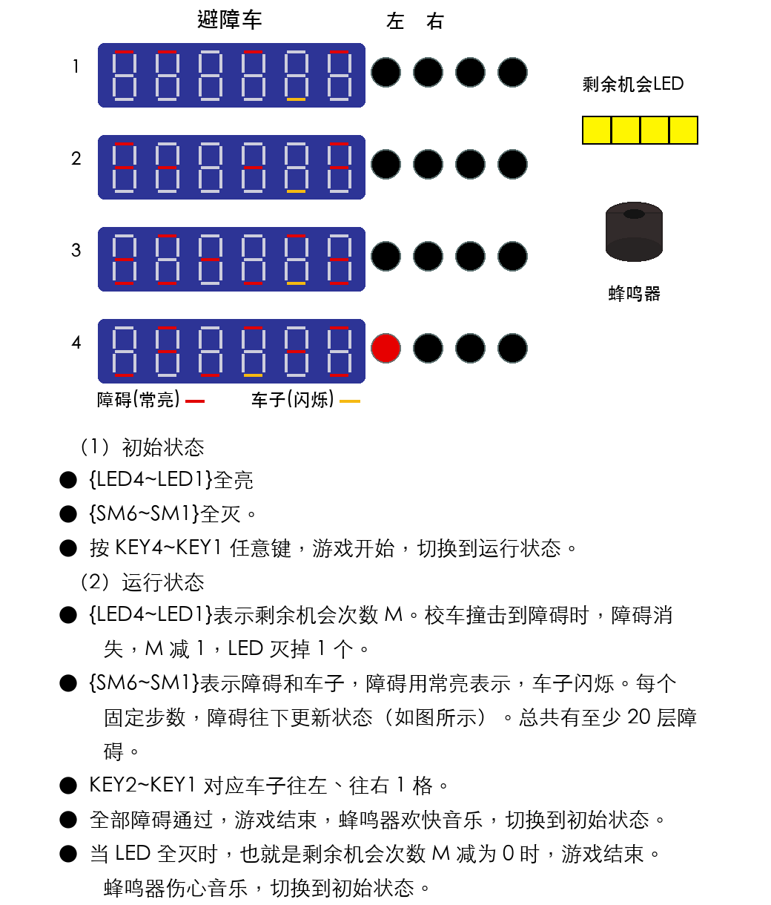

# 避障车 (Obstacle Avoidance Car) 项目需求与设计文档

## 1. 项目背景与目标
本项目基于数字综合课程设计要求，在 FPGA 开发板上实现一款名为“避障车”的交互式小游戏。游戏利用开发板上的数码管、LED 阵列、独立按键以及蜂鸣器，构建一个完整的状态机，实现障碍物生成、车辆移动控制、碰撞检测与生命值管理等核心数字电路控制逻辑。

---

## 2. 硬件资源分配与映射

根据开发板资源描述，本项目使用的硬件外设分配如下：

| 硬件外设 | 编号/标识 | 游戏功能映射 | 状态说明 |
| :--- | :--- | :--- | :--- |
| **按键 (Keys)** | `KEY1` ~ `KEY4` (从右至左) | **游戏控制** | 任意键：开始游戏。 `KEY1`：车子向右移动1格。 `KEY2`：车子向左移动1格。 |
| **LED 灯** | `LED1` ~ `LED4` (从右至左) | **剩余机会 (HP)** | 初始全亮（4次机会）。每撞击一次障碍灭一个。 |
| **数码管 (SM)** | `SM1` ~ `SM6` (从右至左) | **游戏主画面** | 显示车辆与障碍物。 **障碍**：对应段码**常亮**。 **车子**：对应段码**闪烁**。 |
| **蜂鸣器** | Buzzer | **音效反馈** | 游戏结束时的背景音乐（胜利欢快/失败伤心）。 |

### 2.1 图示显示约定
- `SM6` ~ `SM1` 表示游戏主画面，用于同时显示障碍和车子。
- 障碍使用数码管段码**常亮**表示，在图示中用红色标注。
- 车子使用数码管段码**闪烁**表示，在图示中用黄色标注。
- `LED4` ~ `LED1` 表示剩余机会次数 $M$，亮起的 LED 数量对应当前剩余机会。
- 蜂鸣器用于游戏结算后的音效反馈：胜利播放欢快音乐，失败播放伤心音乐。

---

## 3. 游戏状态机 (FSM) 核心逻辑

游戏主要分为两个核心状态：**初始状态 (Initial State)** 和 **运行状态 (Running State)**。

### 3.1 初始状态 (待机界面)
- **视觉呈现**：
  - 生命值：`LED4` ~ `LED1` 全部点亮。
  - 游戏画面：数码管 `SM6` ~ `SM1` 全部熄灭。
- **状态转移**：
  - 玩家按下 `KEY4` ~ `KEY1` 中的任意按键，触发状态转移，游戏正式开始，进入**运行状态**。

### 3.2 运行状态 (游戏进行中)
- **剩余机会显示**：
  - `LED4` ~ `LED1` 表示剩余机会次数 $M$。
- **画面滚动与障碍更新**：
  - `SM6` ~ `SM1` 表示障碍和车子，障碍用常亮表示，车子用闪烁表示。
  - 每隔一个**固定的步数（时间间隔）**，数码管上的障碍物状态向下更新一次（如图所示），模拟车子向前行驶的视觉效果。
  - 关卡总长度：至少包含 **20 层障碍**。
- **玩家交互**：
  - 玩家通过 `KEY2` 和 `KEY1` 控制闪烁的“车子”在当前行移动，以躲避常亮的“障碍”。
  - `KEY2`：车子向左移动 1 格。
  - `KEY1`：车子向右移动 1 格。
- **碰撞检测与生命值扣除**：
  - 当车子的坐标与障碍物的坐标重合时，触发碰撞。
  - 碰撞发生后：当前撞击的障碍物消失，剩余机会次数 $M$ 减 1，对应的 LED 熄灭 1 个。
- **运行结束条件**：
  - 全部障碍通过后，游戏结束，蜂鸣器播放欢快音乐，并切换到**初始状态**。
  - 当 `LED4` ~ `LED1` 全灭时，即剩余机会次数 $M = 0$，游戏结束，蜂鸣器播放伤心音乐，并切换到**初始状态**。

---

## 4. 游戏结算与反馈机制

游戏在运行状态中实时检测胜利或失败条件，并在结束后给予视听反馈，随后自动返回初始状态。

### 🔴 失败条件 (Game Over)
- **触发条件**：当 4 个 LED 全部熄灭（即剩余机会次数 $M = 0$ 时）。
- **反馈效果**：蜂鸣器播放**“伤心音乐”**（建议采用低频降调的音效）。
- **后续动作**：音乐播放完毕或持续一段时间后，自动切换回**初始状态**。

### 🟢 胜利条件 (Game Clear)
- **触发条件**：成功通过全部（至少 20 层）障碍。
- **反馈效果**：蜂鸣器播放**“欢快音乐”**（建议采用高频升调的电子音效，如类似通关音效）。
- **后续动作**：音乐播放完毕后，自动切换回**初始状态**。

---

## 5. 💡 高分创新拓展建议 (Bonus Points)
为了在结题验收中获得酌情加分，建议在满足上述基础要求外，尝试增加以下功能：

1. **动态难度递增系统**：随着通过障碍的层数增加，逐渐缩短障碍物向下更新的时间间隔（画面加速），提升游戏紧张感。
2. **PWM 呼吸灯特效**：将剩余机会的 LED 改为呼吸灯显示，在扣除机会时增加“爆闪后熄灭”的动画。
3. **音乐合成引擎**：利用 FPGA 内部的分频器和 ROM 查找表，将要求中的“欢快/伤心音乐”从单调的蜂鸣声升级为具有节奏和音高变化的 8-bit 单声部旋律。
